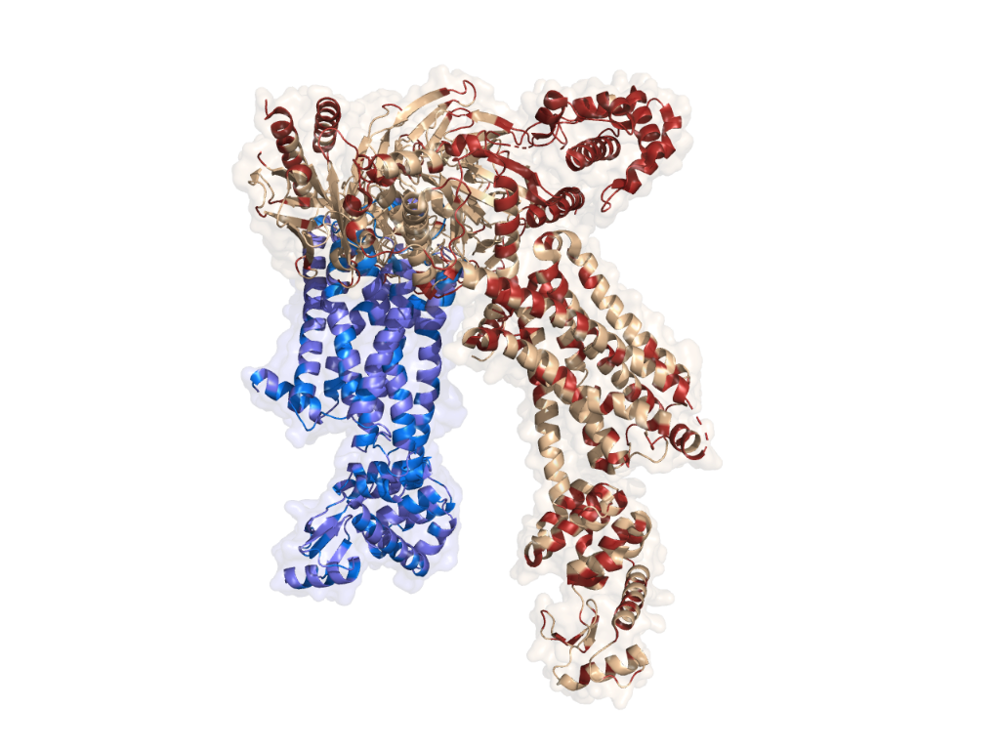
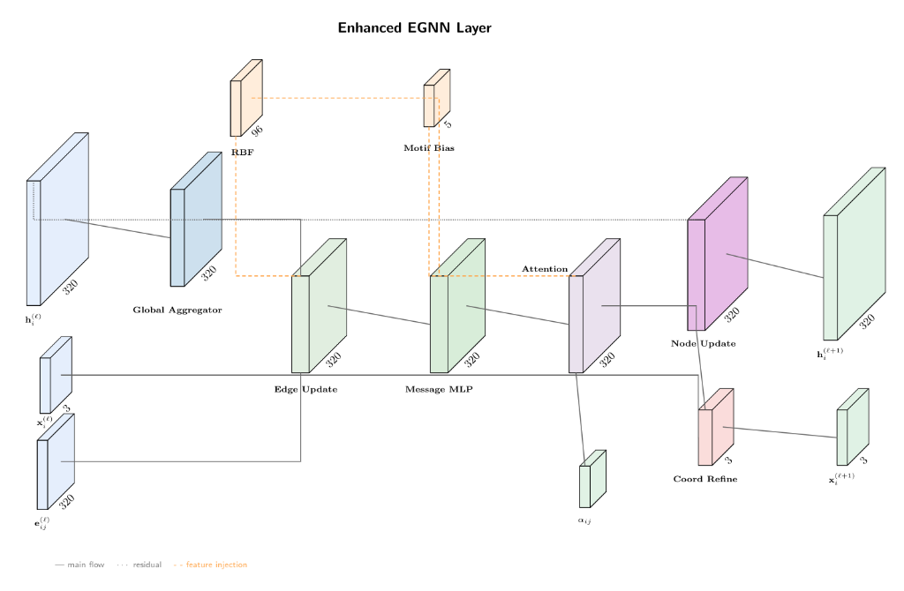

<div align="center">
  <h1>HYALINE</h1>
  <strong>Geometric Deep Learning for GPCR Activation State Prediction</strong>
  <br><br>
  
  [Paper](https://www.biorxiv.org/content/10.64898/2026.01.05.697778v1) | [Data](Supplementary_Data_1.csv)
  <br><br>
</div>

<p align="center">
  
</p>

HYALINE predicts whether a G protein-coupled receptor (GPCR) structure is in an **active** or **inactive** conformational state using E(n)-equivariant graph neural networks. GPCRs are the largest family of drug targets, with ~35% of FDA-approved drugs acting on these receptors.

The model achieves **0.995 AuROC** on cross-validation and **0.819 AuROC** on a temporal held-out test set (structures released 2023–2024), outperforming sequence-only baselines by 6–12%. Notably, HYALINE achieves 87.2% accuracy on Class C GPCRs where sequence-based methods fail (39.4%).

For technical details, see the [paper](https://www.biorxiv.org/content/10.64898/2026.01.05.697778v1).

## Installation

```bash
pip install git+https://github.com/Varosync/Hyaline.git
```

Or from source:
```bash
git clone https://github.com/Varosync/Hyaline.git
cd Hyaline; pip install -e .
```

Requirements: Python 3.10+, PyTorch 2.0+, PyTorch Geometric

## Inference

```bash
hyaline predict structure.pdb
```

Output:
```
HYALINE PREDICTION
  Score:       0.9521
  Prediction:  Active
  Confidence:  High
```

Scores >0.5 indicate active state, <0.5 indicate inactive state. Higher absolute values indicate greater confidence.

## Architecture

<p align="center">
  
</p>

HYALINE uses an enhanced E(n)-equivariant graph neural network with:
- **ESM3 embeddings** (1536-dim) for sequence features
- **RBF distance encoding** (96-dim) for spatial relationships  
- **Learned motif attention** that autonomously prioritizes conserved activation switches (DRY, NPxxY, CWxP)

## Data

The curated dataset contains **1,596 GPCR structures** from the Protein Data Bank with activation state annotations from GPCRdb. The complete list of PDB IDs with train/test splits is provided in [`Supplementary_Data_1.csv`](Supplementary_Data_1.csv).

## Citation

If you use HYALINE in your research, please cite:

```bibtex
@article{hyaline2026,
  title   = {HYALINE: Geometric Deep Learning for Accurate Prediction of 
             G Protein-Coupled Receptor Activation States from Structure},
  author  = {Varosync},
  journal = {bioRxiv},
  year    = {2026},
  doi     = {10.64898/2026.01.05.697778}
}
```

## License

MIT License
